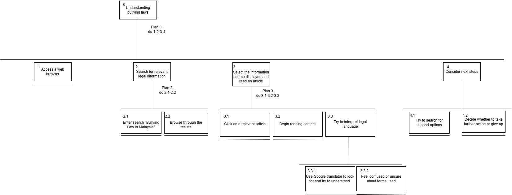

# Gathering Requirements - Task Analysis

## Introduction

This task analysis aims to understand how users currently find legal support through existing methods before the development of **JustiLink**. Users often rely on government websites, translation tools, or public forums, but these are not always accessible, user-friendly, or privacy-protected. Understanding these limitations is essential to designing a more effective legal support system.

---

# Task 1: Understand Legal Content in Simple Language

## High School Student

**Textual Presentation**

0. Understand bullying laws  
 1. Access a web browser  
 2. Search for relevant legal information  
  2.1 Enter search “Bullying Law in Malaysia”  
  2.2 Browse through search results  
 3. Select the information source displayed and read an article  
  3.1 Click on a relevant article  
  3.2 Begin reading content  
  3.3 Try to interpret legal language  
   3.3.1 Use Google translator to look for and try to understand  
   3.3.2 Feel confused or unsure about terms used  
 4. Consider next step  
  4.1 Try to search for support options  
  4.2 Decide whether to take further action or give up  

**Plans**

- Plan 0: Do 1 → 2 → 3 → 4  
- Plan 2: Do 2.1 → 2.2  
- Plan 3: Do 3.1 → 3.2 → 3.3  
- Plan 3.3: Do 3.3.1 → 3.3.2  
- Plan 4: Do 4.1 → 4.2  

**Diagram Presentation**

---

## Migrant Construction Worker

**Textual Presentation**

0. Sign a work contract  
 1. Receive contract  
  1.1 Notice the contract is in English and Malay  
  1.2 Read and interpret the contract  
 2. Attempt to understand the contract  
  2.1 Open translation tool  
  2.2 Paste content to translation tool  
  2.3 Read the translated text  
 3. Evaluate translation quality  
  3.1 Notice poor translation and awkward structure  
  3.2 Feel unsure about the meaning  
  3.3 Decide whether to seek help or proceed  
 4. Decide whether to sign the contract  
  4.1 Sign the document  
  4.2 Submit the signed contract  

**Plans**

- Plan 0: Do 1 → 2 → 3 → 4  
- Plan 1: Do 1.1 → 1.2  
- Plan 2: Do 2.1 → 2.2 → 2.3  
- Plan 3: Do 3.1 → 3.2 → 3.3  
- Plan 4: Do 4.1 → 4.2  

**Diagram Presentation**

---

## Office Worker

**Textual Presentation**

0. Know rights on medical claims  
 1. Attempt to search for information online  
  1.1 Use google to search for local employment laws  
  1.2 Read and interpret the content  
   1.2.1 Observe confusing legal jargon  
   1.2.2 Show signs of confusion or frustration  
   1.2.3 Feel uncertain about what is applicable  
 2. Seek for additional help  
  2.1 Call the labour department helpline  
  2.2 Listen to the instructions and requirements  
   2.2.1 Hear about long procedures  
   2.2.2 Learn that many documents and personal information are needed  
   2.2.3 Feel overwhelmed and discouraged  
    2.2.3.1 Feel that the system is too complicated for ordinary people  
 3. Leaving problem unsolved  
  3.1 Give up on claiming medical costs  

**Plans**

- Plan 0: Do 1 → 2 → 3  
- Plan 1: Do 1.1 → 1.2  
- Plan 1.2: Do 1.2.1 → 1.2.2 → 1.2.3  
- Plan 2: Do 2.1 → 2.2  
- Plan 2.2: Do 2.2.1 → 2.2.2 → 2.2.3  
- Plan 2.2.3: Do 2.2.3.1 → 3.1  
- Plan 3: Do 3.1  

**Diagram Presentation**

.png)

# Task 2: Anonymous First Chat Feature

## High School Student
0. Looking for anonymous legal advice  
 1. Search online  
  1.1 Read legal websites  
  1.2 Still confused  
  1.3 Look for anonymous advice  
 2. Check NGO/legal aid sites  
  2.1 Find contact page  
  2.2 See “chat with us”  
  2.3 See personal info required  
   2.3.1 Decide not to proceed  
   2.3.2 Worry about exposure  
 3. Try forums (Reddit/Quora)  
  3.1 Post anonymous question  
  3.2 Read replies  
  3.3 Still feel unsure  
   3.3.1 Save links/screenshots  
 4. Exit browser  
  4.1 Clear history  
  4.2 Close all tabs  

## Office Worker
0. Searching about medical claims  
 1. Open social media  
  1.1 Search legal forums/groups  
  1.2 Scroll recent posts  
 2. Try to ask  
  2.1 Start typing question  
 3. Feel unsure  
  3.1 Worry about job risk  
  3.2 Delete draft  
  3.3 Feel hopeless  
 4. Give up  
  4.1 Close laptop  

---

# Task 3: Mobile-First, User-Centered Interface

## Migrant Construction Worker
0. Find legal help via mobile  
 1. Use phone to search  
  1.1 Open browser  
  1.2 Enter search keywords  
 2. Load site  
  2.1 Wait for page  
  2.2 Site too slow  
   2.2.1 Try refreshing  
   2.2.2 Wait again  
   2.2.3 Give up  
 3. Try to interact  
  3.1 Buttons not responsive  
  3.2 Font too small  

## Office Worker
0. Access legal help on budget phone  
 1. Connect to public Wi-Fi  
  1.1 Turn on Wi-Fi  
  1.2 Connect to available hotspot  
 2. Search legal help  
  2.1 Open browser  
  2.2 Search “employee legal help Malaysia”  
  2.3 Tap first result  
 3. Interact with site  
  3.1 Wait for page to load  
  3.2 Scroll and zoom  
  3.3 Buttons not working  
  3.4 Pop-ups appear  
  3.5 Close pop-ups  
 4. Assess layout  
  4.1 Layout too cluttered  
  4.2 Hard to read  
  4.3 Phone heats up  
 5. Exit  
  5.1 Close site  
  5.2 Feel disappointed  
